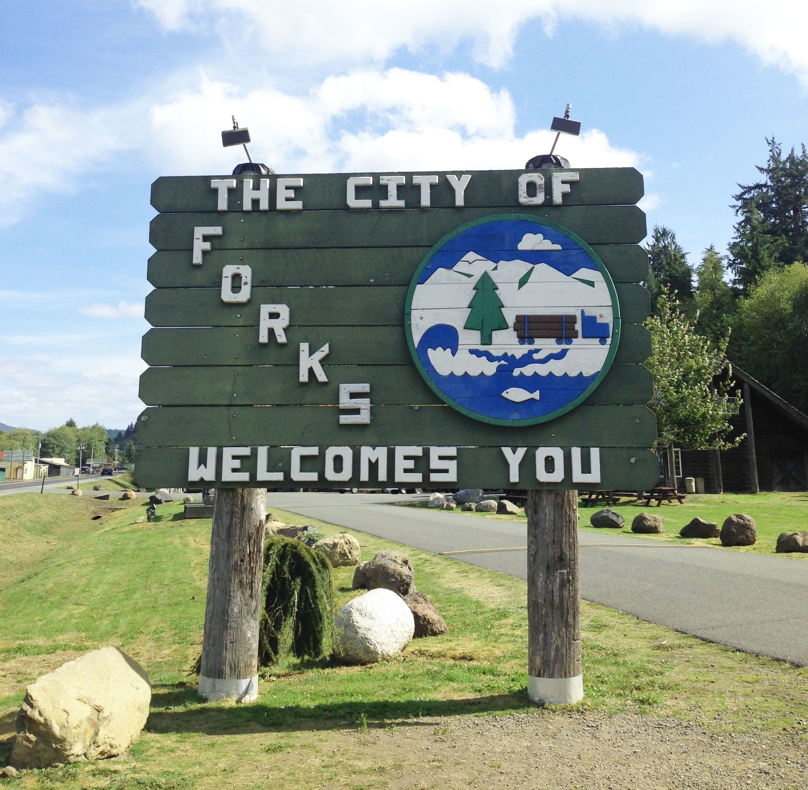

# 2024ctf



Welcome to the Forks, Washington repository! This project is dedicated to providing information and resources about Forks, a small city located in Clallam County, Washington. Forks is known for its lush natural beauty, rich history, and its fame as a key setting in the "Twilight" series by Stephenie Meyer.

## Overview

Forks, Washington, is a picturesque city situated on the Olympic Peninsula. Surrounded by the Olympic National Park and the Pacific Ocean, Forks is a haven for outdoor enthusiasts, offering opportunities for hiking, fishing, and exploring the Hoh Rain Forest. This repository aims to compile useful information, travel tips, historical facts, and local insights about Forks to help visitors and residents alike.

## Features

- **Travel Guide**: Explore the best attractions, accommodations, and dining options in Forks.
- **<span style="color:#FFFFEE">Historical Information</span>**: Learn about the history of Forks and its development over the years.
- **Nature and Wildlife**: Discover the natural beauty and wildlife that make Forks unique.
- **"Twilight" Connection**: Dive into the connection between Forks and the "Twilight" series, including notable locations featured in the books and movies.
- **Community Resources**: Find local resources, events, and community activities.

## Installation

To get started with this repository, clone it to your local machine using the following command:

```bash
git clone https://github.com/puckk/forks-washington.git
```
